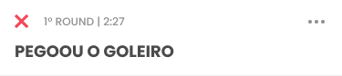
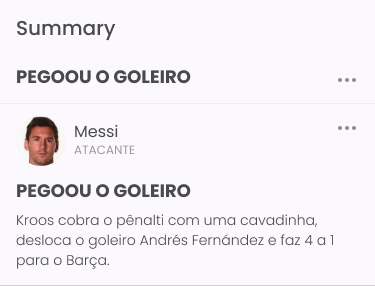
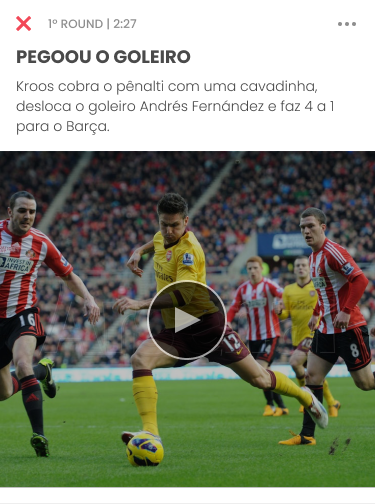

# Arena Android SDK [](https://app.bitrise.io/app/c35ffcea29b2e8a6)
Integrate live blog, analytics and real time data services into your Android client applications with speed and efficiency. Our Android SDK helps you focus on the client's implementation of booting, configuring live blog and sending events.

- [Requirements](#requirements)
- [Sample](#sample)
- [LiveBlog](#liveblog)
- [Analytics](#analytics)
- [RealTimeData](#realtimedata)
- [Getting Help](#help)
- [License](#license)

<a name="requirements"></a>
# Requirements
 - **Minimum Android SDK**: Arena Sdk requires a minimum API level of 21.
 - **Compile Android SDK**: Arena Sdk requires you to compile against API 29 or later.


<a name="sample"></a>
# Sample
A [sample](sample) application is available that showcases the majority of the features offered by
the Arena SDK.


<a name="liveblog"></a>
# Liveblog

Integrate the live blog in real time into your Android client applications with speed and efficiency.  Our SDK helps you focus on the client's implementation of initializing, configuring and displaying the live blog.
Displays all card types in live blog format. We currently support the following cards:

##### Card Title


##### Description


##### Title And Description


##### Publisher


##### Pinned


##### Summary


##### Player/Person


##### Golf


##### Article


##### Social


##### Video



#### Step 1: Create a live blog from your dashboard
Ask your account manager for your publisher slug

#### Step 2: Install the Live Blog SDK

Installing the Live Blog SDK is simple if you’re familiar with using external libraries or SDKs. To install the Live Blog SDK using `Gradle`, add the following lines to a `build.gradle` file at the app level.

```groovy
repositories {
    mavenCentral()
}

dependencies {
    implementation 'im.arena:liveblog:1.22.0'
}
````

#### Step 3: Configure ProGuard to shrink code and resources
When you build your APK with minifyEnabled true, add the following line to the module's ProGuard rules file.
```gradle
-keep class im.arena.liveblog.** { *; }
-keep class im.arena.analytics.** { *; }
-keep class im.arena.commons.** { *; }
-keep class im.arena.realtimedata.** { *; }
```


#### Step 4: Setup SDK
Initialization links the SDK to the Android context, allowing you to respond to connection and status changes.
The LiveBlog.setup() method must be called once across your Android client app. It is recommended to initialize the in the onCreate() method of the Application instance.

```kotlin
LiveBlog.configure(APPLICATION)
```
*  `APPLICATION`: Base class for maintaining global application state.


#### Step 5: Start SDK
To initialize the sdk it is necessary to add the LiveBlog in the xml:

```xml
<im.arena.liveblog.LiveBlog 
        android:id="@+id/live_blog"
        android:layout_width="match_parent"
        android:layout_height="match_parent" />
```

And start the event watcher by passing the following parameters:
```kotlin
live_blog.start(PUBLISH_SLUG, EVENT_SLUG, LIFECYCLE_OWNER, CLICK_LISTENER)
```

*  `PUBLISH`: The publisher slug will be provided by Arena.
*  `EVENT_SLUG`: Live blog identifier
*  `LIFECYCLE_OWNER`: A class that has an Android lifecycle. These events can be used by custom components to handle lifecycle changes without implementing any code inside the Activity or the Fragment.
*  `CLICK_LISTENER`: Interface definition for a callback to be invoked when a view is clicked.


<a name="analytics"></a>
# Analytics

Analytics helps you measure your users, product, and business. It unlocks insights into your app's funnel, core business metrics, and whether you have product-market fit.


#### Step 1: Install the Analytics SDK

Installing the Analytics SDK is simple if you’re familiar with using external libraries or SDKs. To install the Analytics SDK using `Gradle`, add the following lines to a `build.gradle` file at the app level.

```groovy
repositories {
    mavenCentral()
}

dependencies {
    implementation 'im.arena:analytics:1.13.0'
}
````

#### Step 2: Configure ProGuard to shrink code and resources
When you build your APK with minifyEnabled true, add the following line to the module's ProGuard rules file.
```gradle
-keep class im.arena.analytics.** { *; }
-keep class im.arena.commons.** { *; }
-keep class com.google.firebase.iid.** { *; }
```


#### Step 3 : Setup SDK
The `Analytics.configure(application, writeKey, environment)` method must be called once across your Android client app. It is recommended to initialize the in the onCreate() method of the Application instance.

```kotlin
Analytics.configure(APPLICATION, WRITE_KEY)
```

*  `APPLICATION`: Base class for maintaining global application state.
*  `WRITE_KEY`: The write key is the one used to initialize the SDK and will be provided by Arena team


The analysis service offers some types of metrics:


###### TRACK
The `track()` call is how you record any actions your users perform, along with any properties that describe the action.

Each action is known as an event. Each event has a name, like Subscribed, and properties, for example a Subscribed  event might have properties like plan or couponCode 

```kotlin
Analytics.instance().track("Post Reacted", 
        hashMapOf<String, String>().apply {
            put("postId", "WOR06DvfpcRaylQJoZe")
            put("reaction", "thumbs_up")
})
```

*  `EVENT`: The name of the event
*  `PROPERTIES`: Additional properties that can be sent together with the event


###### PAGE
The `page()` call is how you register the screens that your users see, along with the properties that describe the action.

```kotlin 
Analytics.instance().page("Home", 
        hashMapOf<String, String>().apply {
            put("postId", "WOR06DvfpcRaylQJoZeu")
            put("reaction", "thumbs_up")
})
```

*  `SCREEN`: The name of the screen that was viewed
*  `PROPERTIES`: Additional properties that can be sent together with the event


###### IDENTIFY
`identify()` lets you tie a user to their actions and record traits about them. It includes a unique User ID and any optional traits you know about them like their email, name, etc.

We recommend to call identify in these situations:

- After a user registers or log in
- When a user updates their info
- After loading a page that is accessible by a logged in user

```kotlin 
Analytics.instance().identify("43564gfdrtysdg34234", 
        hashMapOf<String, String>().apply {
            put("name", "John Doe")
            put("email", "john@nocompany.com")
            put("plan", "business")
})
```

*  `USER_ID`: Unique User ID
*  `TRAITS`: Optional traits you know about them like their email, name, etc.


<a name="realtimedata"></a>
# RealTimeData

Using this mode you're controlling how the date will be displayed entirely on your side, we will provide a data stream with all information.


#### Step 1: Install the RealTimeData SDK

Installing the RealTimeData SDK is simple if you’re familiar with using external libraries or SDKs. To install the RealTimeData SDK using `Gradle`, add the following lines to a `build.gradle` file at the app level.

```groovy
repositories {
    mavenCentral()
}

dependencies {
    implementation 'im.arena:realtimedata:1.24.0'
}
````

#### Step 2: Configure ProGuard to shrink code and resources
When you build your APK with minifyEnabled true, add the following line to the module's ProGuard rules file.
```gradle
-keep class im.arena.realtimedata.** { *; }
```


#### Step 3 : Setup SDK
Initialization links the SDK to the Android context, allowing you to respond to connection and status changes.
The RealTimeData.setup() method must be called once across your Android client app. It is recommended to initialize the in the onCreate() method of the Application instance.

```kotlin
RealTimeData.configure(APPLICATION)
```
*  `APPLICATION`: Base class for maintaining global application state.

The real time data service offers some alternatives for customers to consume data:

###### SNAPSHOTS
Returns a list of raw data

```kotlin
 RealTimeData
            .playByPlay
            .snapshots(
                QUERY,
                { success->
                },
                { error->
                }, PER_PAGE
            )
```

*  `QUERY`: Query to request the information provided through the method `RealTimeData.playByPlay.query(EVENT_KEY)`
*  `PER_PAGE`: Number of items per page


###### REALTIME
Real time data listener

```kotlin
RealTimeData
    .playByPlay
    .realtime(QUERY,
        { success->
        },
        { error->
        })
```

*  `QUERY`: Query to request the information provided through the method `RealTimeData.playByPlay.query(EVENT_KEY)`
*  `PER_PAGE`: Number of items per page

The return of this call is the `ListenerRegistration` which can be used later to cancel the real time data stream by calling `listenerRegistration.remove()`


###### QUERY
Build the query to retrieve the data.

```kotlin
RealTimeData.playByPlay.query(EVENT_KEY, PRIORITY, ORDER_BY, PER_PAGE, QUERY_INFO)
```

*  `EVENT_KEY`: Event identifier
*  `PRIORITY`: The priority in which elements should be returned: `ASCENDING` or `DESCENDING`
*  `ORDER_BY`: The order in which elements should be returned: `NEWEST` or `OLDEST`
*  `PER_PAGE`: Number of items per page
*  `QUERY_INFO`: The type of query to be performed. We currently only offer `PLAY_BY_PLAY`

Returns a `Query` object containing the information needed to perform a real-time or just a single query

<a name="help"></a>
# Help
We use [GitHub Issues][1] as our bug and feature tracker both for code and for other aspects of the library (documentation, the wiki, etc.).  
Labels on issues are managed by contributors, you don't have to worry about them. Here's a list of what they mean:

 * **bug**: feature that should work, but doesn't
 * **enhancement**: minor tweak/addition to existing behavior
 * **feature**: new behavior, bigger than enhancement, it gives more bang
 * **question**: no need to modify sdk to fix the issue, usually a usage problem
 * **duplicate**: there's another issue which already covers/tracks this
 * **wontfix**: working as intended, or won't be fixed due to compatibility or other reasons
 * **non-library**: issue is not in the core library code, but rather in documentation, samples, build process, releases


# License

Arena Android SDK is proprietary software, all rights reserved. See the LICENSE file for more info.

Copyright (c) 2020  Arena Im.


[1]: https://github.com/stationfy/Arena-SDK-Android-demo/issues
